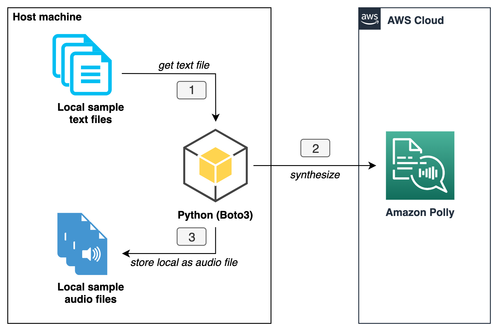

# Generate Amazon Polly sample audio files for all supported voices in all supported languages.

This project helps to generate Amazon Polly small sample audio files (total size < 3MB)
for all by Amazon Polly supported all languages, and all voices for each language for all engines (`neural` and `standard`),
or an individual engine.


### Prerequisites
- AWS Account with sufficient [AWS Identity and Access Management (IAM)](https://aws.amazon.com/iam/) permissions.
- [Python 3.8](https://www.python.org/downloads/) or later and
  [pip package installer](https://pip.pypa.io/en/stable/), to package Python code for Lambda.
    - Note: I recommend that you use a
      [virtual environment](https://packaging.python.org/guides/installing-using-pip-and-virtual-environments/) or
      [virtualenvwrapper](https://virtualenvwrapper.readthedocs.io/en/latest/)
      to isolate the solution from the rest of your Python environment.
- Install python dependencies
    - `pip install -r ./requirements.txt`

### Flow Overview



### How to use this tool
All you need to do is to run the command below to generate sample audio files for `neural` and `standard` engines.

```shell
$ python ./python.py
```

### Sample output
```shell
$ python ./python.py
synthesizing: ./audio/neural/German-de-DE-Vicki.mp3
synthesizing: ./audio/neural/German-de-AT-Hannah.mp3
synthesizing: ./audio/neural/German-de-DE-Daniel.mp3
...

synthesized 32 audio files for engine: neural


synthesizing: ./audio/standard/German-de-DE-Vicki.mp3
synthesizing: ./audio/standard/German-de-DE-Marlene.mp3
synthesizing: ./audio/standard/German-de-DE-Hans.mp3
...

synthesized 60 audio files for engine: standard
```


## Security

See [CONTRIBUTING](CONTRIBUTING.md#security-issue-notifications) for more information.

## License

This project is licensed under the Apache-2.0 License.

